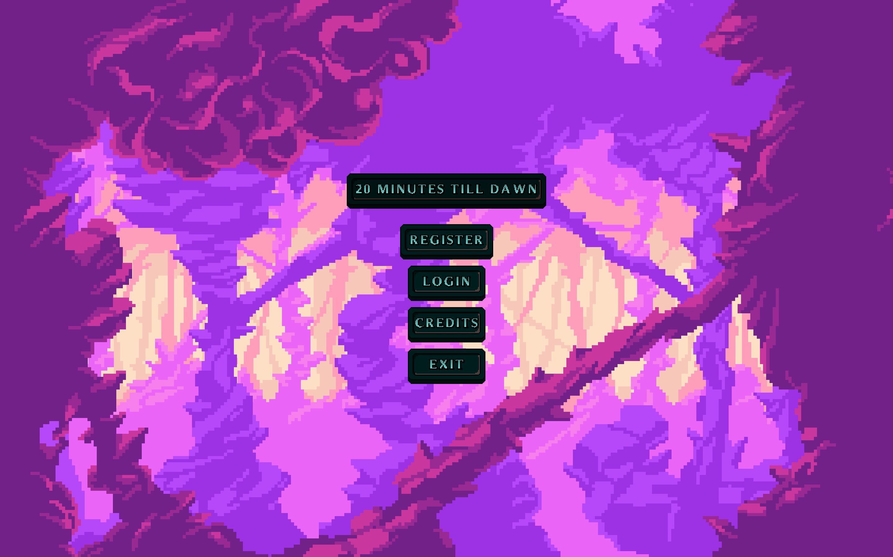
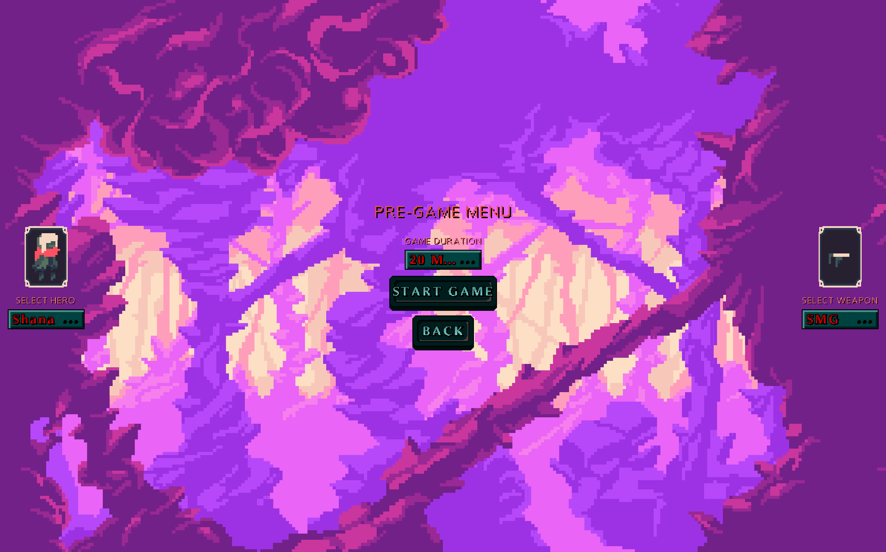
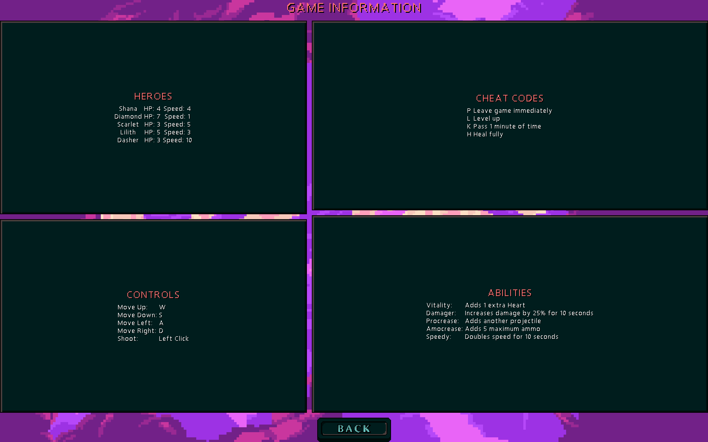
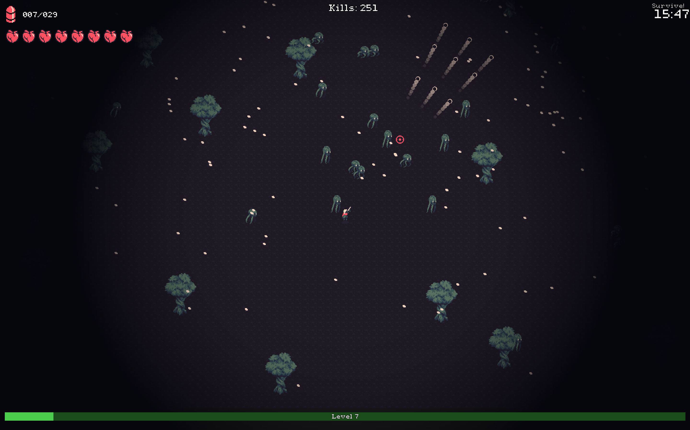

# 20 Minutes Until Dawn (LibGDX remake)

A desktop Java game inspired by “20 Minutes Till Dawn,” built with [LibGDX](https://libgdx.com/) and the LWJGL3 backend. The project uses [Gradle](https://gradle.org/) (with the Gradle Wrapper) to manage dependencies and tasks. It features a parallax background, a polished splash sequence, Scene2D UI, and convenient developer tasks to generate and package assets and runnable JARs.

> Fan project. Not affiliated with or endorsed by the original creators of “20 Minutes Till Dawn.”

---

## Table of contents
- [Overall Features](#overall-features)
- [Features](#features)
- [Screenshots](#screenshots)
- [Tech stack](#tech-stack)
- [Project structure](#project-structure)
- [Getting started](#getting-started)
- [Run and build](#run-and-build)
- [Controls and UX](#controls-and-ux)
- [Configuration](#configuration)
- [Assets and credits](#assets-and-credits)
- [Contributing](#contributing)
- [Acknowledgements](#acknowledgements)
- [License](#license)
---

## Overall Features
- Fully implemented Heroes system with different health and speed.
- Functional Guns which have different DPS and ammunition.
- Save game system which can be polished alittle further.
- Boss fight system that has the ability to dash and create a boss arena to fight in.
- Different enemies, 1 projectile enemy and 1 melee enemy that have different formula for spawning in.
- Leveling system that gradually gets more advanced and harder to progress with 6 abilities to upgrade.
- The game also supports SFX, meaning the game has music, gunshot and death SFX.
- Every enemy has different VFX, with death VFX and also shooting VFX as well.
---

## Features
- Desktop app using LWJGL3 backend for LibGDX.
- Splash sequence with fading logos and transition into the pre-menu.
- Parallax background loading and rendering.
- Scene2D UI styled with the Pixthulhu skin.
- Fullscreen-first experience with F11 toggle and focus recovery.
- Custom window icons and VSYNC-friendly configuration.
- Drag-and-drop support on desktop window (experimental avatar file hand-off).
- Gradle task to auto-generate `assets/assets.txt` based on the `assets/` directory.
- Cross-platform runnable JAR generation, plus a Mac-only JAR variant.
- IntelliJ IDEA/Eclipse project support via Gradle tasks.

---

## Screenshots

[](assets/screenshots/01-main-menu.png)
[](assets/screenshots/02-gameplay-early.png)
[](assets/screenshots/03-abilities-ui.png)
[](assets/screenshots/05-swarm.png)


---

## Tech stack
- LibGDX: `gdxVersion=1.13.5`
- LWJGL3 backend (desktop)
- Java 17 for core and desktop modules
- Gradle with Wrapper
- Optional GraalVM native setup (disabled by default)

Key files:
- Desktop launcher: [`lwjgl3/src/main/java/untildawn/com/lwjgl3/Lwjgl3Launcher.java`](https://github.com/Mehrshaddlt/20-Minutes-Until-Dawn/blob/df324efacd2e75a1f8b5109293a3c1e836bef61e/lwjgl3/src/main/java/untildawn/com/lwjgl3/Lwjgl3Launcher.java)
- Game entry: [`core/src/main/java/untildawn/com/Main.java`](https://github.com/Mehrshaddlt/20-Minutes-Until-Dawn/blob/df324efacd2e75a1f8b5109293a3c1e836bef61e/core/src/main/java/untildawn/com/Main.java)
- Splash view: [`core/src/main/java/untildawn/com/View/SplashScreenView.java`](https://github.com/Mehrshaddlt/20-Minutes-Until-Dawn/blob/df324efacd2e75a1f8b5109293a3c1e836bef61e/core/src/main/java/untildawn/com/View/SplashScreenView.java)

---

## Project structure
- `core/` — shared game logic (LibGDX core).
- `lwjgl3/` — desktop launcher and platform-specific config.
- `assets/` — game art, audio, UI skin, shaders, and generated `assets.txt`.

Notable folders under `assets/`:
- Abilities, Avatars, Weapons
- Enemies, ElderMonster, HitFX, DeathFX
- Heroes, HealthAndAmmo
- Music, SFX
- background (parallax layers)
- pixthulhu (Scene2D skin)
- shaders

Gradle configuration:
- [`settings.gradle`](https://github.com/Mehrshaddlt/20-Minutes-Until-Dawn/blob/df324efacd2e75a1f8b5109293a3c1e836bef61e/settings.gradle) includes subprojects: `core`, `lwjgl3`.
- [`build.gradle`](https://github.com/Mehrshaddlt/20-Minutes-Until-Dawn/blob/df324efacd2e75a1f8b5109293a3c1e836bef61e/build.gradle) configures IDE tasks, asset list generation, repositories.
- [`core/build.gradle`](https://github.com/Mehrshaddlt/20-Minutes-Until-Dawn/blob/df324efacd2e75a1f8b5109293a3c1e836bef61e/core/build.gradle) sets Java 17, adds `gdx` and `gdx-freetype`.
- [`lwjgl3/build.gradle`](https://github.com/Mehrshaddlt/20-Minutes-Until-Dawn/blob/df324efacd2e75a1f8b5109293a3c1e836bef61e/lwjgl3/build.gradle) sets the main class, Java 17, and packaging tasks (`jar`, `jarMac`).

---

## Getting started
Requirements:
- JDK 17 (the project uses Java 17 in `core` and `lwjgl3`).
- Git.
- No need to install Gradle — the Gradle Wrapper is included.

The build uses the Foojay Toolchains Resolver to help with JDK provisioning:
- See `plugins` in `settings.gradle` (`org.gradle.toolchains.foojay-resolver-convention`).

Clone the repo:
```bash
git clone https://github.com/Mehrshaddlt/20-Minutes-Until-Dawn.git
cd 20-Minutes-Until-Dawn
```

Optionally import into your IDE:
- IntelliJ IDEA: run `./gradlew idea`, then open the project.
- Eclipse: run `./gradlew eclipse`, then import as an existing project.

---

## Run and build
Run the desktop app:
```bash
# macOS/Linux
./gradlew lwjgl3:run

# Windows
gradlew.bat lwjgl3:run
```

Build a runnable JAR (cross-platform natives included):
```bash
# macOS/Linux
./gradlew lwjgl3:jar

# Windows
gradlew.bat lwjgl3:jar
```
The JAR will be in `lwjgl3/build/libs/` with name `${appName}-${projectVersion}.jar`.

Build a smaller macOS-only JAR:
```bash
./gradlew lwjgl3:jarMac
```

Useful Gradle flags:
- `--continue` continue after errors
- `--daemon` use Gradle daemon
- `--offline` use cached deps
- `--refresh-dependencies` re-validate all deps

IDE project tasks:
- `clean`, `cleanIdea`, `cleanEclipse`, `idea`, `eclipse`

Asset list generation:
- A task `generateAssetList` scans `assets/` and writes `assets/assets.txt`.
- `processResources` depends on `generateAssetList`, so it runs during normal builds.

---

## Controls and UX
- Fullscreen toggle: `F11`.
- On launch, the app tries to start in fullscreen and keeps continuous rendering.
- The launcher applies VSYNC (`useVsync(true)`) and sets `foregroundFPS` to monitor refresh rate + 1.
- Drag-and-drop: dropping files onto the window passes the first file path into the game (`Main.consumeDroppedAvatarFile()`), intended for future avatar/customization workflows.

---

## Configuration
Desktop launcher defaults:
- Title: “20 minutes till dawn”
- Windowed fallback: 1920×1080

Java:
- Desktop `lwjgl3` module: Java 17, release 17.
- Core `core` module: Java 17.

Gradle properties:
```ini
enableGraalNative=false
graalHelperVersion=2.0.1
gdxVersion=1.13.5
projectVersion=1.0.0
```

Optional native builds:
- If you set `enableGraalNative=true` in `gradle.properties`, GraalVM-related dependencies/plugins are enabled in the desktop module. Additional setup is required (GraalVM installation and native build tooling).

---

## Assets and credits
- Pixthulhu UI skin by Raymond “Raeleus” Buckley — CC BY 4.0  
  See [`assets/pixthulhu/README.md`](assets/pixthulhu/README.md).
- Font: “Express” by Chevy Ray — file `assets/ChevyRay - Express.ttf` (see upstream license).
- Game art/audio placeholders under `assets/` are for development and demonstration.

If you reuse or distribute this project, please respect the licenses of third-party assets.

---

## Contributing
Issues and PRs are welcome. Suggested contributions:
- Gameplay systems (enemies, weapons, abilities, waves).
- UI/UX refinement for menus and HUD.
- Performance improvements and asset pipeline tooling.
- Cross-platform packaging and CI.

Please follow typical Java/LibGDX conventions and keep modules (`core`, `lwjgl3`) cleanly separated.


---

## Acknowledgements
- Inspired by the game “20 Minutes Till Dawn.”
- Thanks to the LibGDX community and Raymond “Raeleus” Buckley for the Pixthulhu skin.

---

## License
This repository currently does not declare a code license.
feel free to use whatever you want. :)
This project was created as for the homework of Advanced Programing class of Sharif University of Technology.
